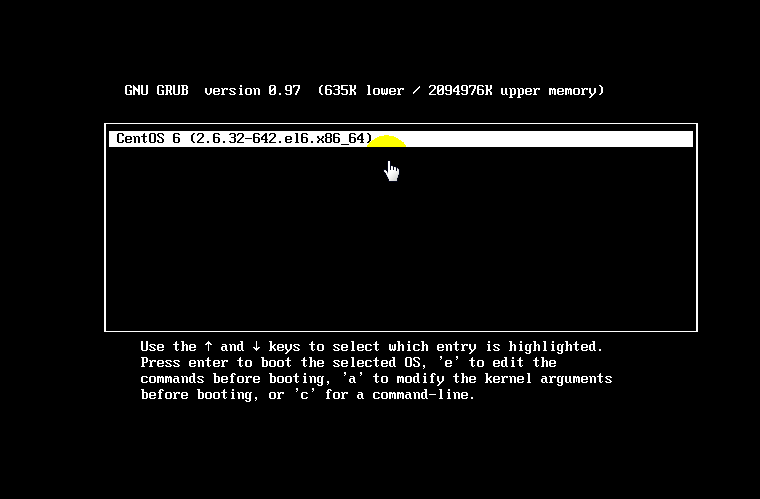
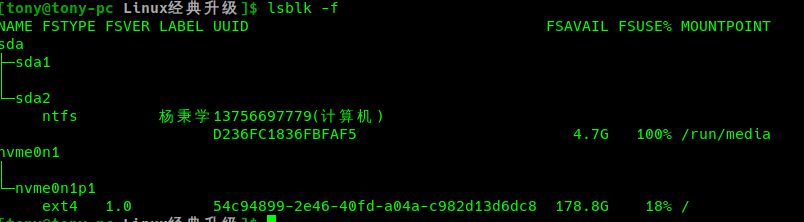
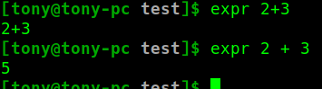

# 尚硅谷 韩顺平 Linux(升级版)
[在线视频](https://www.bilibili.com/video/av80936373?from=search&seid=6845162039405466324) &emsp; [详细课堂笔记](note/README.md) &emsp; [课件ppt](课件/尚硅谷_韩顺平_Linux(大数据_javaEE_Python_开发通用版)课件.pdf) &emsp; [课件图解](课件/图解1.xlsx) &emsp; [笔记](课件/尚硅谷_韩顺平_Linux课程(兼顾_大数据_JavaEE_Python程序员).pdf) <br>[尚硅谷Python安装Ubuntu.docx](课件/尚硅谷Python安装Ubuntu.docx) &emsp; [尚硅谷centos6.8下安装mysql.docx](课件/尚硅谷centos6.8下安装mysql.docx)

## 一、关机&重启命令
基本介绍:
```bash
$> sync            # 把内存的数据同步到磁盘.    
#关机之间建议执行一次
$> shutdown –h now # 立该进行关机
$> shudown -h 1    # 1 分钟后会关机了
$> shutdown –r now #现在重新启动计算机

$> halt            # 关机，作用和上面一样.
$> reboot          
$> logout          # 注销，在图形运行级别无效，在运行级别 3 下有效
```

## 二、用户管理
### 1.添加用户
基本语法
```bash
$> useradd 用户名

# 会自动的创建和用户同名的家目录
# -d 指定目录 新的用户名，给新创建的用户指定家目录
$> useradd 用户名 -d /home/test    # /home/test之前不能存在
```

### 2.指定/修改密码
基本语法
```bash
$> passwd 用户名
```

### 3.删除用户
基本语法
```bash
$> userdel 用户名
```

### 4.删除用户
基本语法
```bash
$> userdel 用户名

1) 删除用户xiaoming，但是要保留家目录
$> userdel tony
2) 删除用户以及用户家目录
$> userdel -r tony
```

### 5.查询用户信息指令
基本语法
```bash
$> id 用户名

[tony@tony-pc ~]$ id tony
uid=1000(tony) gid=1000(tony) groups=1000(tony),998(wheel),991(lp),3(sys),90(network),98(power),56(bumblebee)
```

### 6.查看当前用户/登录用户
基本语法
```bash
$> whoami/ who am I
```

### 7.新增组
基本语法
```bash
$> groupadd 组名
```

### 8.删除组
基本语法
```bash
$> groupdel 组名
```
### 9.增加用户时直接加上组
基本语法
```bash
$> useradd –g 用户组 用户名
```

### 10.修改用户的组
基本语法
```bash
$> usermod –g 用户组 用户名
```

### 11.用户和组的相关文件
```bash
/etc/passwd 文件
    用户（user）的配置文件，记录用户的各种信息
    每行的含义：用户名:口令:用户标识号:组标识号:注释性描述:主目录:登录Shell
/etc/shadow 文件
    口令的配置文件
    每行的含义：登录名:加密口令:最后一次修改时间:最小时间间隔:最大时间间隔:警
    告时间:不活动时间:失效时间:标志
/etc/group 文件
    组(group)的配置文件，记录Linux包含的组的信息
    每行含义：组名:口令:组标识号:组内用户列表
```

### 12.[如何找回root密码 15:55](https://www.bilibili.com/video/av80936373?p=22)
单用户模式不需要输入密码就是root



## 三、权限
### -R
-R 如果是目录 则使其下所有子文件或目录递归生效

## 四、crond 任务调度
常用选项|概述
:-:|:-:
-e| 编辑crontab定时任务
-l| 查询crontab任务
-r| 删除当前用户所有的crontab

```bash
crond 相关指令:
1) conrtab –r：终止任务调度。
2) crontab –l：列出当前有那些任务调度
3) service crond restart [重启任务调]
```
```bash
$> crontab –e
# 每个域之间用空格分隔,
*/1 * * * * ls –l /etc/ > /tmp/to.txt   #每小时的每分钟执行ls –l /etc/ > /tmp/to.txt命令
```

特殊符号 |含义
:-:|:-:
* |代表任何时间。比如第一个“*”就代表一小时中每分钟都执行一次的意思。
， |代表不连续的时间。比如“0 8,12,16 * * * 命令”，就代表在每天的8点0分，12点0分，16点0分都执行一次命令
-| 代表连续的时间范围。比如“0 5 * * 1-6命令”，代表在周一到周六的凌晨5点0分执行命令
*/n |代表每隔多久执行一次。比如“*/10 * * * * 命令”，代表每隔10分钟就执行一遍命令

#### 参数细节说明
时间 |含义
:-:|:-:
45 22 * * * 命令 |在22点45分执行命令
0 17 * * 1 命令 |每周1 的17点0分执行命令
0 5 1,15 * * 命令 |每月1号和15号的凌晨5点0分执行命令
40 4 * * 1-5 命令 |每周一到周五的凌晨4点40分执行命令
*/10 4 * * * 命令 |每天的凌晨4点，每隔10分钟执行一次命令
0 0 1,15 * 1 命令 |每月1号和15号，每周1的0点0分都会执行命令。

**注意：星期几和几号最好不要同时出现，因为他们定义的都是天。非常容易让管理员混乱。**

## 五、分区
### 1.分区的方式：
#### 1) mbr分区:
- 1.最多支持四个主分区
- 2.系统只能安装在主分区
- 3.扩展分区要占一个主分区
- 4.MBR最大只支持2TB，但拥有最好的兼容性
#### 2) gtp分区:
- 1.支持无限多个主分区（但操作系统可能限制，比如 windows下最多128个分区）
- 2.最大支持18EB的大容量（1EB=1024 PB，1PB=1024 TB ）
- 3.windows7 64位以后支持gtp

### 2.硬盘说明
1) Linux硬盘分IDE硬盘(**并口**)和SCSI硬盘(**串口**)，目前基本上是SCSI硬盘。

2) IDE硬盘——“hdx~”,其中“hd”表明分区所在设备的类型，这里是指
> “x”为盘号（a为基本盘，b为基本从属盘，c为辅助主盘，d为辅助从属盘）
>
> “~”代表分区，前四个分区用数字1到4表示，它们是主分区或扩展分区，从5开始就是逻辑分区。
>
> eg:hda3表示为第一个IDE硬盘上的第三个主分区或扩展分区,hdb2表示为第二个IDE硬盘上的第二个主分区或扩展分区。

3) SCSI硬盘——“sdx~”

### 3.分区挂载情况
```
$> lsblk -f
```


### 4.永久挂载: 通过修改/etc/fstab实现挂载添加完成后 执行mount –a 即刻
```bash
$> vim /etc/fstab
/dev/sdb1       /home/newdisk   ext4    default     0 0  

$> mount -a
```

### 5.磁盘情况查询
```
du -h /目录
查询指定目录的磁盘占用情况，默认为当前目录
-s 指定目录占用大小汇总
-h 带计量单位
-a 含文件
--max-depth=1 子目录深度
-c 列出明细的同时，增加汇总值
```
#### 1) 统计/home文件夹下文件的个数
```bash
$> ll /home | grep "^-" | wc -l
```

#### 2) 统计/home文件夹下目录的个数
```bash
$> ll /home | grep "^d" | wc -l
```

#### 3) 统计/home文件夹下文件的个数，包括子文件夹里的
```bash
$> ll -R /home | grep "^-" | wc -l
```

## 六、网络配置
### 1.linux网络环境配置
```bash
$> vi /etc/sysconfig/network-scripts/ifcfg-eth0
```
## 七、进程
### 1.ps

```bash
-aux #System V展示风格
%CPU：进程占用CPU的百分比
%MEM：进程占用物理内存的百分比
VSZ：进程占用的虚拟内存大小（单位：KB）
RSS：进程占用的物理内存大小（单位：KB）
```

```bash
-ef #是BSD风格
PID：进程ID 
PPID：父进程ID 
```

### 2.pstree
```bash
-p :显示进程的PID
-u :显示进程的所属用户
```

### 3.服务(service)
服务(service) 本质就是进程，但是是运行在后台的，通常都会监听某个端口，等待其它程序的请求，比如(mysql , sshd 防火墙等)，因此我们又称为守护进程，是Linux中非常重要的知识点。

### 4.动态监控进程
top与ps命令很相似。它们都用来显示正在执行的进程。Top与ps最大的不同之处，在于top在执行一段时间可以更新正在运行的的进程。

选项 |功能
:-:|:-:
-d 秒数| 指定top命令每隔几秒更新。默认是3秒在top命令的交互模式当中可以执行的命令
-i| 使top不显示任何闲置或者僵死进程。
-p| 通过指定监控进程ID来仅仅监控某个进程的状

### 5.监控网络状态——netstat
```bash
-an 按一定顺序排列输
-p 显示哪个进程在调用
```

## 七、RPM与YUM
### 1.查询指令——q
```bash
rpm -qa :查询所安装的所有rpm软件包
    rpm -qa | more 
    rpm -qa | grep X [rpm -qa | grep firefox ]
rpm -q 软件包名 :查询软件包是否安装
    rpm -q firefox
rpm -qi 软件包名 ：查询软件包信息
    rpm -qi firefox
rpm -ql 软件包名 :查询软件包中的文件
    rpm -ql firefox
rpm -qf 文件全路径名 查询文件所属的软件包
    rpm -qf /etc/passwd
    rpm -qf /root/install.log
```

### 2.卸载rpm包——e
```bash
#如果其它软件包依赖于您要卸载的软件包，卸载时则会产生错误信息。
$> rpm -e --nodeps firefox
```

### 3.安装rpm包
```
i=install 安装
v=verbose 提示
h=hash 进度条
```

### 4.查询yum服务器是否有需要安装的软件
```bash
$> yum list|grep xx软件列表
```

---
## 八、Shell
### 1.显示当前shell中所有变量：set
```bash
案例1：定义变量A
    $> A=100
案例2：撤销变量A
    $> unset A
案例3：声明静态的变量B=2，不能unset
    #声明静态变量：readonly变量，注意：不能unset
    $> readonly A=80
案例4：可把变量提升为全局环境变量，可供其他shell程序使用
```

### 2.定义变量的规则
- 1) 变量名称可以由字母、数字和下划线组成，但是不能以数字开头。
- 2) **等号两侧不能有空格**
- 3) 变量名称一般习惯为大写

### 3.将命令的返回值赋给变量
- 1）```A=`ls -la` ```反引号，运行里面的命令，并把结果返回给变量A
- 2）```A=$(ls -la)``` 等价于反引号

### 4.设置环境变量
1) export 变量名=变量值 （功能描述：将shell变量输出为环境变量）

2) source 配置文件 （功能描述：让修改后的配置信息立即生效）

3) echo $变量名 （功能描述：查询环境变量的值）

### 5.位置参数变量
基本语法
```
$n （功能描述：n为数字，$0代表命令本身，$1-$9代表第一到第九个参数，十以上的参数，十以上的参数需要用大括号包含，如${10}）
$* （功能描述：这个变量代表命令行中所有的参数，$*把所有的参数看成一个整体）
$@（功能描述：这个变量也代表命令行中所有的参数，不过$@把每个参数区分对待）
$#（功能描述：这个变量代表命令行中所有参数的个数）
```
```bash
$> vim test.sh
#! /bin/sh
echo "$0 $1 $2"
echo "$*"
echo "$@"
echo "para is $#"

$> ./test.sh YBX handsome
./test.sh YBX handsome
YBX handsome
YBX handsome
para is 2
```

### 6.预定义变量
就是shell设计者事先已经定义好的变量，可以直接在shell脚本中使用。
```
$$ （功能描述：当前进程的进程号（PID））
$! （功能描述：后台运行的最后一个进程的进程号（PID））
$？ （功能描述：最后一次执行的命令的返回状态。如果这个变量的值为0，证明上一个命令正确执行；如果这个变量的值为非0（具体是哪个数，由命令自己来决定），则证明上一个命令执行不正确了。）
```
```bash
#!/bin/sh
echo "当前的进程号=$$"
firefox &
echo "最后的进程号=$!"
echo "执行的值=$?"
```

### 7.运算符
```
1) “$((运算式))”或“$[运算式]”
2) expr m + n 
注意expr运算符间要有空格
3) expr m - n
4) expr \*, /, % 乘，除，取余
```

```bash
[tony@tony-pc test]$ cat test.sh 
#! /bin/sh
echo "SUM two parameters"
RESULT=$[$1+$2]
echo "result=$RESULT"

[tony@tony-pc test]$ ./test.sh 12 34
SUM two parameters
result=46
```

### 8.条件判断
#### 1)基本语法
```[ condition ] ``` **（注意condition前后要有空格）**
#非空返回true，可使用$?验证（0为true，>1为false）

#### 2)流程控制
##### (1)判断语句
###### 1) 两个整数的比较
```bash
    = 字符串比较
    -lt 小于
    -le 小于等于
    -eq 等于
    -gt 大于
    -ge 大于等于
    -ne 不等于
```

###### 2) 按照文件权限进行判断
```bash
    -r 有读的权限
    -w 有写的权限
    -x 有执行的权限
```

###### 3)按照文件类型进行判断
```bash
    -f 文件存在并且是一个常规的文件
    -e 文件存在
    -d 文件存在并是一个目录
```

###### 4) 应用实例
```bash
[tony@tony-pc test]$ cat ./test.sh
#!/bin/sh
if [ "ok" = "ok" ]
then 
    echo "equal"
fi

if [ -r aaa.txt ]
then 
    echo "have r"
fi

if [ -e /root/shell/aaa.txt ]   #/root/shell/aaa.txt 目录中的文件是否存在
then 
	echo "exist"
fi

if [ -d /root ]
then
	echo "Directory"
fi

if [ 23 -ge 22 ]
then 
    echo "23大于等于22"
fi

[tony@tony-pc test]$ ./test.sh 
equal
have r
exist
Directory
23大于等于22
```

##### (2)if
```bash
#请编写一个shell程序，如果输入的参数，大于等于60，则输出 "及格了"，如果小于60,则输出 "不及格"
#!/bin/sh
if[ $1 -ge 60]
then
    echo "passed"
elif
    echo "No passed"
fi
```

##### (3)case
```bash
#当命令行参数是 1 时，输出 "周一", 是2 时，就输出"周二"， 其它情况输出 "other"
[tony@tony-pc test]$ cat test.sh 
#!/bin/sh
case $1 in
"1")
    echo "Monday"
    ;;
"2")
    echo "Tuesday"
    ;;
*)
    echo "Other"
    ;;
esac

[tony@tony-pc test]$ ./test.sh 2
Tuesday

[tony@tony-pc test]$ ./test.sh 1
Monday

[tony@tony-pc test]$ ./test.sh 333
Other
```

##### (4)for
```bash
# 第一种语法
for 变量 in 值1 值2 值3… 
do 
    程序
done

[tony@tony-pc test]$ cat test.sh 
#!/bin/sh
echo "Test: \$*"
for i in "$*"
do
	echo "the num is $i"
done

echo "Test: \$@"
for i in "$@"
do
	echo "the num is $i"
done
[tony@tony-pc test]$ ./test.sh 111 222 333
Test: $*
the num is 111 222 333
Test: $@
the num is 111
the num is 222
the num is 333

```

```bash
# 第二种语法
for (( 初始值;循环控制条件;变量变化 )) 
do 
    程序
done

[tony@tony-pc test]$ cat test.sh 
#!/bin/sh
SUM=0
for((i=1; i<=100; i++))
do
	SUM=$[$SUM+$i]
done
echo "sum = $SUM"
[tony@tony-pc test]$ ./test.sh 
sum = 5050

```

### (5)while
```bash
while [ 条件判断式 ] 
do 
    程序
done

[tony@tony-pc test]$ cat test.sh 
#!/bin/sh
SUM=0                   #这里=两侧没有空格
i=0
while [ $i -le 100 ]    #这里while后面必须有空格
do
	SUM=$[$SUM+$i]
	i=$[ $i+1 ]
done
echo "SUM is $SUM"
[tony@tony-pc test]$ ./test.sh 
SUM is 5050

```

### 9.read读取控制台输入——与用户交互
```bash
read(选项)(参数)
选项：
-p：指定读取值时的提示符；
-t：指定读取值时等待的时间（秒），如果没有在指定的时间内输入，就不再等待了。。
参数
变量：指定读取值的变量名
```
```bash
# 案例1：读取控制台输入一个num值
[tony@tony-pc test]$ cat test.sh 
#!/bin/sh
read -p "Please input some num = " NUM1
echo "You input is $NUM1"
[tony@tony-pc test]$ ./test.sh 
Please input some num = 111
You input is 111

案例2：读取控制台输入一个num值，在5秒内输入
[tony@tony-pc test]$ cat test.sh 
#!/bin/sh
read -t 5 -p "Please input some num = " NUM1
echo "You input is $NUM1"
[tony@tony-pc test]$ ./test.sh 
Please input some num = You input is 
[tony@tony-pc test]$ 

```

### 10.函数
shell编程和其它编程语言一样，有系统函数，也可以自定义函数
#### 1)系统函数
##### (1)basename基本语法
返回完整路径最后 / 的部分，常用于获取文件名
```bash
# 请返回 /home/tony/Downloads/linux-2.6.10.tar.gz 的 "linux-2.6.10.tar.gz" 部分
[tony@tony-pc test]$ basename /home/tony/Downloads/linux-2.6.10.tar.gz 
linux-2.6.10.tar.gz
```

##### (2)dirname基本语法
返回完整路径最后 / 的前面的部分，常用于返回路径
```bash
# 请返回 /home/tony/Downloads/linux-2.6.10.tar.gz 的 "/home/tony/Downloads/" 部分
[tony@tony-pc test]$ dirname /home/tony/Downloads/linux-2.6.10.tar.gz 
/home/tony/Downloads
```
#### 2)自定义函数
```bash
[ function ] funname[()]
{
    Action;
    [return int;]
}

# 计算输入两个参数的和
[tony@tony-pc test]$ cat test.sh 
#!/bin/sh
function getSum(){	#不需要形参
	SUM=$[$n1+$n2]
	echo "SUM=$SUM"
}

read -p "Please input first num: " n1
read -p "Please input second num: " n2

getSum $n1 $n2
[tony@tony-pc test]$ ./test.sh 
Please input first num: 90
Please input second num: 44
SUM=134
```

### 11.Shell编程综合案例
需求分析
- 1) 每天凌晨 2:10 备份 数据库 atguiguDB 到 /data/backup/db
- 2) 备份开始和备份结束能够给出相应的提示信息
- 3) 备份后的文件要求以备份时间为文件名，并打包成 .tar.gz 的形式
> 比如：2018-03-12_230201.tar.gz
- 4) 在备份的同时，检查是否有10天前备份的数据库文件，如果有就将其删除。

```bash
[tony@tony-pc test]$ date +%Y_%m_%d_%H%M%S
2020_03_08_120632
```

```bash
#!/bin/sh
BACKUP=/data/backup/db
DATETIME=${data +Y_%m_%d_%H%M%S}

echo "Start backup"

HOST=localhost
DB_USER=root
DB_PASSWORD=12345
DATEBASE=atguiguDB

[ ! -d "$BACKUO/$DATETIME" ] && mkdir -p "$BACKUO/$DATETIME"

mysqldump -u${DB_USER} -p ${DB_PASSWORD --host=$HOST $DATEBASE | gzip > $BACKUP/$DATETIME/$DATETIME.sql.gz}

cd $BACKUP
tar -zcvf $DATETIME.tar.gz $DATETIME
rm -rf $BACKUP/$DATETIME/

find $BACKUP -mtime +10 "*.tar.gz" -exec rm -rf{} \;

```
---

## 九、Ubuntu的root 用户
### 1.给root用户设置密码并使用
- 1) 输入 sudo passwd 命令，输入一般用户密码并设定root用户密码。
- 2) 设定root密码成功后，输入 su 命令，并输入刚才设定的root密码，就可以切换成root了。提示符$代表一般用户，提示符#代表root用户。
- 3) 输入 exit 命令，退出root并返回一般用户
- 4) 以后就可以使用root用户了


